# SwiftUI-ListDemo
## Creating an editable list with SwiftUI with support for navigation
**(Updated for Xcode 11 Beta 7)**

Based on the WWDC 2019 presentation "Introducing SwiftUI: Building Your First App” (https://developer.apple.com/videos/play/wwdc2019/204/).

These notes describe how to create a simple list of Animal objects that show the animal’s name, description and and image thumbnail. 
Tapping the row containing the animal takes the user to a detail view showing a larger image.

___

## Basics
Start by creating a new single view iOS app (make sure the "Use SwiftUI" checkbox is ticked).
First, create the **Animal** model used in the app:

``` swift
//
//  Animal.swift
//  SwiftUI-ListDemo
//
//  Created by Russell Archer on 21/06/2019.
//  Copyright © 2019 Russell Archer. All rights reserved.
//
// Updated for Xcode 11 Beta 5
//

import Foundation

// To make a type useable in a SwiftUI List it should conform to the
// Identifiable protocol

struct Animal: Identifiable {
    var id = UUID()
    var name: String
    var description: String
    var imageName: String { return name }
    var thumbName: String { return name + "Thumb" }
}

#if DEBUG
    let testData = [
        Animal(name: "Eagle", description: "Flys"),
        Animal(name: "Owl", description: "Hoots"),
        Animal(name: "Parrot", description: "Talks"),
        Animal(name: "Penguin", description: "Waddles"),
        Animal(name: "Zebra", description: "Runs")
    ]
#endif
```
Notice how we create test data and that Swift auto-creates a default initialiser for us on the Animal struct.

Switch to **ContentView.swift** and create the following first-pass UI.
Note that the following images have been added to the Assets catalog:

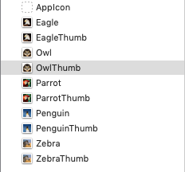

``` swift
//
//  ContentView.swift
//  SwiftUI-ListDemo
//
//  Created by Russell Archer on 21/06/2019.
//  Copyright © 2019 Russell Archer. All rights reserved.
//
// Updated for Xcode 11 Beta 5
//

import SwiftUI

struct ContentView : View {
    var body: some View {
        HStack {
            Image("OwlThumb")
            VStack(alignment: .leading) {
                Text("Owl")
                Text("Hoots")
            }
        }
    }
}
```

The Preview should look as follows:

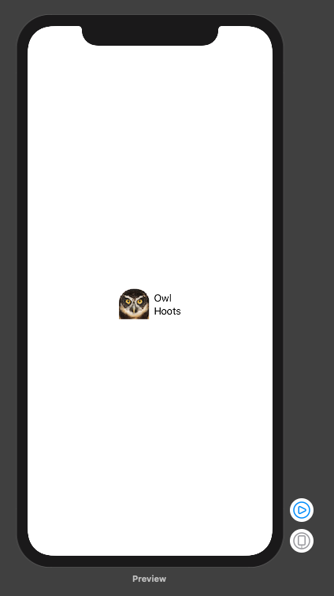

___

## Create a List
To change the **HStack** into a **List** cmd+click the **HStack** and select **Embed in List**:

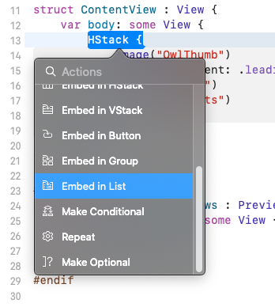

This produces:

``` swift
struct ContentView : View {
    var body: some View {
        List(0 ..< 5) { item in
            Image("OwlThumb")
            VStack(alignment: .leading) {
                Text("Owl")
                Text("Hoots")
            }
        }
    }
}
```

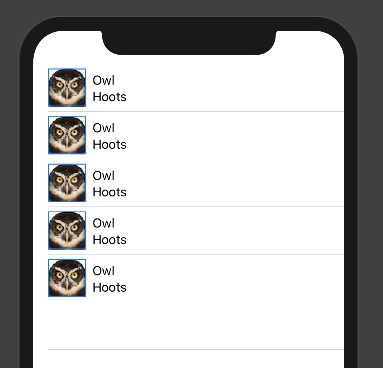

We can now modify **ContentView** to use our test data:

``` swift
//
//  ContentView.swift
//  SwiftUI-ListDemo
//
//  Created by Russell Archer on 21/06/2019.
//  Copyright © 2019 Russell Archer. All rights reserved.
//
// Updated for Xcode 11 Beta 5
//

import SwiftUI

struct ContentView : View {
    var animals: [Animal] = []
   
    var body: some View {
        List(animals) { animal in
            Image(animal.thumbName)
            VStack(alignment: .leading) {
                Text(animal.name)
                Text(animal.description)
            }
        }
    }
}

#if DEBUG
struct ContentView_Previews : PreviewProvider {
    static var previews: some View {
        ContentView(animals: testData)
    }
}
#endif
```

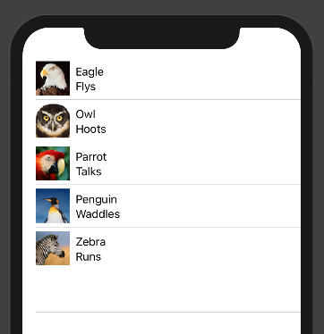

___

## Use Modifiers
We can now apply a **Modifier** to the image thumbnails to create rounded corners.
The easiest way to do this is to open the **Library**, either by click the **+** at the top of the Xcode window...

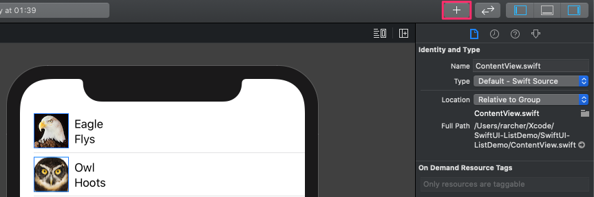

…or by hitting **Shift + Command + L**.
Select the **Modifiers** tab, then locate **Corner Radius**:

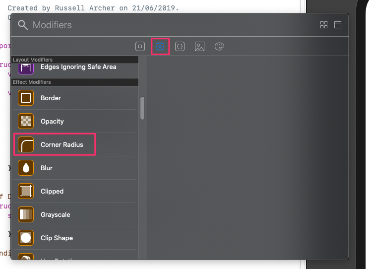

Now drag the **Corner Radius** modifier onto one of the thumbnail images on the preview canvas. 
Xcode updates the **ContentView**:

``` swift
Image(animal.thumbName)
    .cornerRadius(3.0)
```

Set the corner radius modifier value to 10.

___

## Implement row / cell selection
We can now implement the behaviour required for tapping on a row in the list and showing the detail view.
Start by wrapping the **List** in a **NavigationView** and setting the nav bar title, like this:

``` swift
struct ContentView : View {
    var animals: [Animal] = []
   
    var body: some View {
        NavigationView {
            List(animals) { animal in
                Image(animal.thumbName)
                    .cornerRadius(10)
                VStack(alignment: .leading) {
                    Text(animal.name)
                    Text(animal.description)
                }
            }
            .navigationBarTitle(Text("Animals"))
        }
    }
}
```

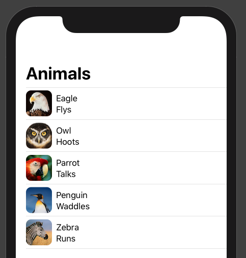

A **NavigationView** displays views and has a stack onto which views may be pushed.
We can setup each row (or cell) in our list as a **NavigationLink** which will push our **ContentView** onto the stack and navigate to the 
destination view (not yet created):

``` swift
struct ContentView : View {
    var animals: [Animal] = []
   
    var body: some View {
        NavigationView {
            List(animals) { animal in
                NavigationLink(destination: Text(animal.name)) {
                    Image(animal.thumbName)
                        .cornerRadius(10)
                    VStack(alignment: .leading) {
                        Text(animal.name)
                        Text(animal.description)
                    }
                }
            }
            .navigationBarTitle(Text("Animals"))
        }
    }
}
```

Notice that our preview immediately shows a nav link for each cell item:

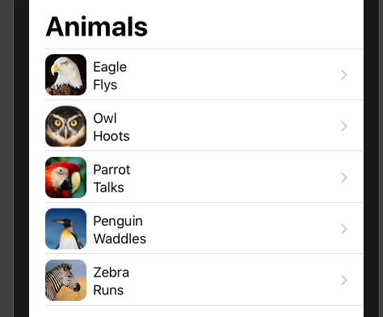

To test the app's navigation, click the **Live Preview** button at the bottom of the Preview window:

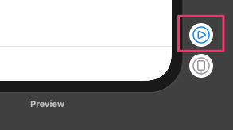


You can see that not only does our navigation work correctly, but we get a destination view and a return (view pop) button.
We get a destination view because the **NavigationLink's** initializer takes any **View** object (and a **Text** object is a type of **View**).

___

## Extract the cell code to a separate View 
If we want, we can extract all the code for the animal cell into a separate **View**:

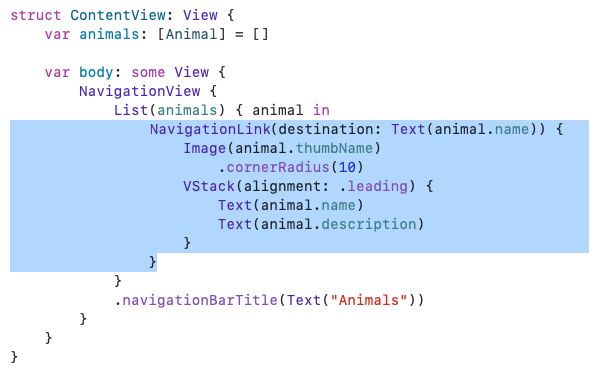

Create a new SwiftUI **View** named **AnimalCell** that has an animal property and takes the standard format for a SwiftUI **View**:

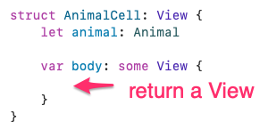

You can now simply cut and paste the **NavigationLink** code into the **AnimalCell**:

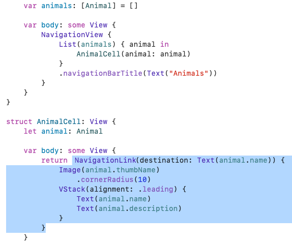

Notice how we pass our animal **List** item to the **AnimalCell**.
Apple recommend composing views from as many smaller views as required, as they are lightweight and impose very little overhead when compiled.

___

## Create the detail View
Create a new SwiftUI **View** and name it **AnimalDetail.swift**:

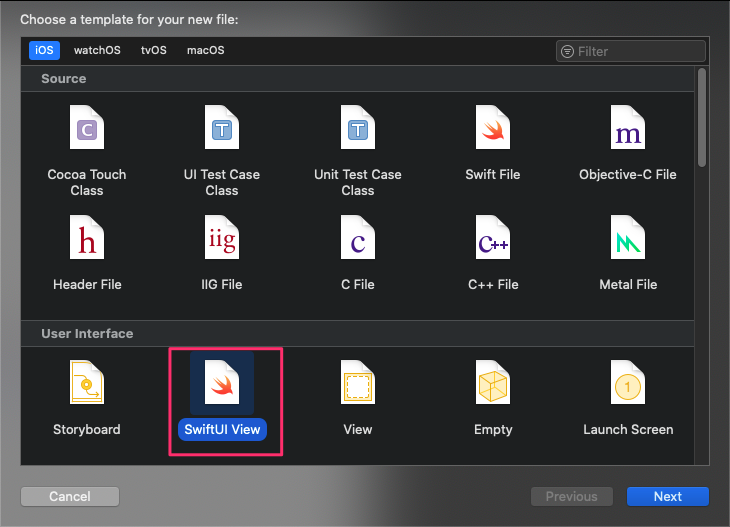

Now create the detail view's UI. Notice how we’ve applied various modifiers to the Image and one of the **Text** views:

``` swift
//
//  AnimalDetail.swift
//  SwiftUI-ListDemo
//
//  Created by Russell Archer on 23/06/2019.
//  Copyright © 2019 Russell Archer. All rights reserved.
//
// Updated for Xcode 11 Beta 5
//

import SwiftUI

struct AnimalDetail : View {
    let animal: Animal
    
    var body: some View {
        VStack {
            Image(animal.imageName)
                .resizable()   // Images are fixed-size by default
                .aspectRatio(contentMode: .fit)
                .cornerRadius(10)
                .padding(.all)

            Text(animal.name)
            Text(animal.description)
                .color(.gray)
        }
    }
}

#if DEBUG
struct AnimalDetail_Previews : PreviewProvider {
    static var previews: some View {
        // Pass the first item in our test data
        AnimalDetail(animal: testData[0])
    }
}
#endif
```

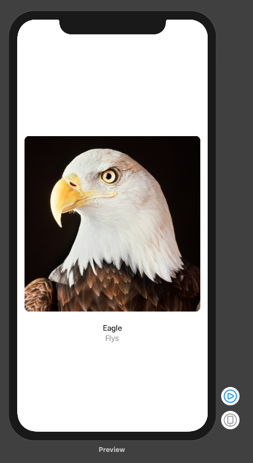

___

## Navigate to the AnimalDetail View
Now all we need to do is modify our **AnimalCell View** in order to create an instance of the **AnimalDetail View** and pass the relevant animal object to it:

``` swift
struct AnimalCell: View {
    let animal: Animal
    
    var body: some View {
        return NavigationLink(destination: AnimalDetail(animal: animal)) {
            Image(animal.thumbName)
                .cornerRadius(10)
            VStack(alignment: .leading) {
                Text(animal.name)
                Text(animal.description)
            }
        }
    }
}
```

Test the app in **Live Preview** mode:

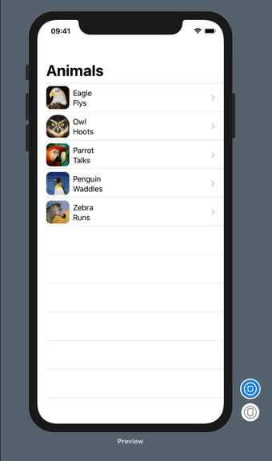

Update the **AnimalDetail View** to show a navigation bar title.
Although navigation bar title this will show up when the app is run, the preview won’t show it.
You can modify the **AnimalDetail_Previews** struct to add a **NavigationView** to our preview:

``` swift
//
//  AnimalDetail.swift
//  SwiftUI-ListDemo
//
//  Created by Russell Archer on 23/06/2019.
//  Copyright © 2019 Russell Archer. All rights reserved.
//
// Updated for Xcode 11 Beta 5
//

import SwiftUI

struct AnimalDetail : View {
    let animal: Animal
    
    var body: some View {
        VStack {
            Image(animal.imageName)
                .resizable()   // Images are fixed-size by default
                .aspectRatio(contentMode: .fit)
                .cornerRadius(10)
                .padding(.all)

            Text(animal.name)
            Text(animal.description)
                .color(.gray)
        }
        .navigationBarTitle(Text("\(animal.name) Details"), displayMode: .inline)
    }
}

#if DEBUG
struct AnimalDetail_Previews : PreviewProvider {
    static var previews: some View {
        // Pass the first item in our test data
        NavigationView {
            AnimalDetail(animal: testData[0])
        }
    }
}
#endif
```

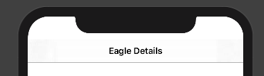

___

## Tap to toggle display mode for the detail image
SwiftUI has the concept of **State** variables and it manages the storage of any property you mark as **@State**. 
When a **State** value changes, the view is re-rendered.

This is somewhat similar in concept to UIKit key-value observing and it makes State variables in SwiftUI incredibly powerful.
State variables are monitored by Swift when they are read or written to. When the value changes the Swift runtime asks the View
for the value of its **body** property again and re-renders the view. 

To demonstrate the concept, we’ll toggle the rendering of the animal detail image when the user taps on the image:

``` swift
struct AnimalDetail : View {
    let animal: Animal
    @State private var isZoomed = false  // State variable
    
    var body: some View {
        VStack {
            Image(animal.imageName)
                .resizable()   // Images are fixed-size by default
                .aspectRatio(contentMode: isZoomed ? .fill : .fit)  // Render the image based on the isZoomed State variable
                .cornerRadius(10)
                .padding(.all)
                .onTapGesture { self.isZoomed.toggle() }  // Add a tap action that toggles the State variable

            Text(animal.name)
            Text(animal.description)
                .color(.gray)
        }
        .navigationBarTitle(Text("\(animal.name) Details"), displayMode: .inline)
    }
}
```

We can even animate the zoom action by wrapping it in a **withAnimation()** modifier:

``` swift
struct AnimalDetail : View {
    let animal: Animal
    @State private var isZoomed = false
    
    var body: some View {
        VStack {
            Image(animal.imageName)
                .resizable()   // Images are fixed-size by default
                .aspectRatio(contentMode: isZoomed ? .fill : .fit)
                .cornerRadius(10)
                .padding(.all)
                .onTapGesture {
                    withAnimation { self.isZoomed.toggle() }
                }

            Text(animal.name)
            Text(animal.description)
                .color(.gray)
        }
        .navigationBarTitle(Text("\(animal.name) Details"), displayMode: .inline)
    }
}
```

___

## Adding support for editing the List
To support editing the list we need to refactor our app to use a *mutable* data model.
Currently, we keep an immutable array of animal structs in **ContentView**.

Create a new Swift file named **AnimalRepository** as shown below.

Here we use Apple’s new **Combine** framework which enables **publishers** (our data model) to broadcast a message when a change occurs. 
Note that our data model conforms to the **ObservableObject** protocol and that the **animals** property is **@Published**. 
The **@Published** prefix is a **property wrapper** and adds a **Publisher** to any property:

``` swift
//
//  AnimalRepository.swift
//  SwiftUI-ListDemo
//
//  Created by Russell Archer on 25/06/2019.
//  Copyright © 2019 Russell Archer. All rights reserved.
//
// Updated for Xcode 11 Beta 5
//

import Foundation
import SwiftUI
import Combine

class AnimalRepository: ObservableObject {
    @Published var animals = [Animal]()
    
    init() {
        // Create initial test data
        animals.append(Animal(name: "Eagle", description: "Flys"))
        animals.append(Animal(name: "Owl", description: "Hoots"))
        animals.append(Animal(name: "Parrot", description: "Talks"))
        animals.append(Animal(name: "Penguin", description: "Waddles"))
        animals.append(Animal(name: "Zebra", description: "Runs"))
    }
}
```

Now modify **ContentView** as follows to use the new data model. 
We also add a “+” button to the navigation bar to allow us to test the mechanism for adding items to our data model.

Notice how we create an **animalStore** property of type **AnimalRepository** that is declared to be a **@ObservedObject**. 
This declares **animalStore** to be a dynamic property that auto-subscribes to an object (our data model) that conforms to the **ObservableObject** protocol. 
This ensures that when our data model changes the View is invalidated and re-rendered.

**@ObservedObject** is similar to **@State** that we used earlier, except that **@ObservedObject** is intended for use with complex reference 
types, such as our data model, rather than simple types like Int, String, etc.

``` swift
struct ContentView: View {
    // animalStore is a dynamic property that auto-subscribes to our data model.
    // When our data model changes the View is invalidated and re-rendered
    @ObservedObject var animalStore: AnimalRepository
    
    var body: some View {
        NavigationView {
            List(animalStore.animals) { animal in
                AnimalCell(animal: animal)
            }
                
            .navigationBarTitle(Text("Animals"))
                
            // Add a "+" button to the nav bar to allow us
            // to test adding data to our model
            .navigationBarItems(
                trailing: Button(action: {
                    self.animalStore.animals.append(
                        Animal(name: "Owl", description: "Test!"))
                }, label: { Image(systemName: "plus") }))
        }
    }
}

struct AnimalCell: View {
    let animal: Animal
    
    var body: some View {
        return NavigationLink(destination: AnimalDetail(animal: animal)) {
            Image(animal.thumbName)
                .cornerRadius(10)
            VStack(alignment: .leading) {
                Text(animal.name)
                Text(animal.description)
            }
        }
    }
}

#if DEBUG
struct ContentView_Previews : PreviewProvider {
    static var previews: some View {
        ContentView(animalStore: AnimalRepository())
    }
}
#endif
```

Also modify **AnimalDetail_Previews**:

``` swift
#if DEBUG
struct AnimalDetail_Previews : PreviewProvider {
    static var previews: some View {
        NavigationView {
            AnimalDetail(animal: Animal(name: "Owl", description: "Hoots"))
        }
    }
}
#endif
```

If you live preview the app you should see that the list is displayed as before, but now we can add new items by tapping the "+" nav bar button.

An alternative way of adding a "Add Animal" **Button** to our **View** is to add it to the **List** itself:

``` swift
struct ContentView: View {
    // animalStore is a property that auto-subscribes to our data model.
    // When our data model changes the View is invalidated and re-rendered
    @ObservedObject var animalStore: AnimalRepository
    
    var body: some View {
        NavigationView {
            List {
                // Add a button to the list itself
                Button(action: addAnimal) {
                    Text("Add Animal")
                }

                // Use the SwiftUI ForEach (i.e. NOT the Swift forEach)
                // to add data to the list
                ForEach(animalStore.animals) { animal in
                    AnimalCell(animal: animal)
                }
            }
                
            .navigationBarTitle(Text("Animals"))
        }
    }

    func addAnimal() {
        animalStore.animals.append(Animal(name: "Owl", description: "Test!"))
    }
}
```

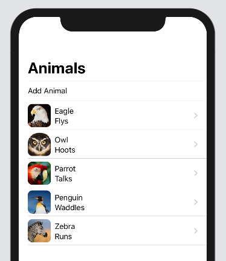

We can improve things by putting the **Button** and data in different sections, like this:

``` swift
var body: some View {
    NavigationView {
        List {
            Section {
                // Add a button to the list itself
                Button(action: addAnimal) {
                    Text("Add Animal")
                }
            }

            Section {
                // Use the SwiftUI ForEach (i.e. NOT the Swift forEach)
                // to add data to the list
                ForEach(animalStore.animals) { animal in
                    AnimalCell(animal: animal)
                }
            }
        }
        .listStyle(.grouped)
        .navigationBarTitle(Text("Animals"))
    }
}
```

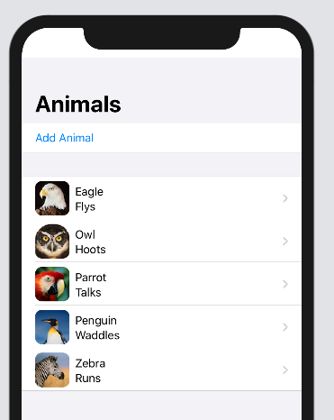

Adding support for deletions is trivial:

``` swift
struct ContentView: View {
    // animalStore is a property that auto-subscribes to our data model.
    // When our data model changes the View is invalidated and re-rendered
    @ObservedObject var animalStore: AnimalRepository
    
    var body: some View {
        NavigationView {
            List {
                Section {
                    // Add a button to the list itself
                    Button(action: addAnimal) {
                        Text("Add Animal")
                    }
                }
                Section {
                    // Use the SwiftUI ForEach (i.e. NOT the Swift forEach)
                    // to add data to the list
                    ForEach(animalStore.animals) { animal in
                        AnimalCell(animal: animal)
                    }
                    .onDelete(perform: deleteAnimals)  // Swipe left to delete
                }
            }
            .listStyle(.grouped)
            .navigationBarTitle(Text("Animals"))
        }
    }
    
    func addAnimal() {
        animalStore.animals.append(Animal(name: "Owl", description: "Test!"))
    }
    
    func deleteAnimals(at offsets: IndexSet) {
        offsets.forEach { index in
            animalStore.animals.remove(at: index)
        }
    }
}
```

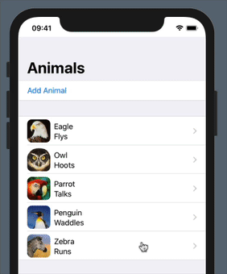

To make delete functionailty obvious, we can easily add an **Edit** button to the navigation bar:

``` swift
struct ContentView: View {
    // animalStore is a property that auto-subscribes to our data model.
    // When our data model changes the View is invalidated and re-rendered
    @ObservedObject var animalStore: AnimalRepository

    var body: some View {
        NavigationView {
            List {
                Section {
                    // Add a button to the list itself
                    Button(action: addAnimal) {
                        Text("Add Animal")
                    }
                }
                
                Section {
                    // Use the SwiftUI ForEach (i.e. NOT the Swift forEach)
                    // to add data to the list
                    ForEach(animalStore.animals) { animal in
                        AnimalCell(animal: animal)
                    }
                    .onDelete(perform: deleteAnimals)  // Swipe left to delete
                }
            }
            .listStyle(.grouped)
                
            .navigationBarTitle(Text("Animals"))
            .navigationBarItems(trailing: EditButton())
        }
    }
    :
```

Tapping the **Edit** button produces the following:

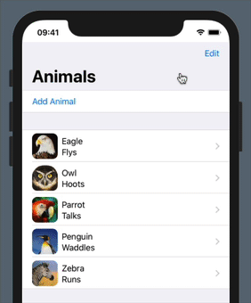

___

## Multiple Previews
You can show multiple previews like this:

``` swift
#if DEBUG
struct ContentView_Previews : PreviewProvider {
    static var previews: some View {
        Group {
            ContentView(animalStore: AnimalRepository())
            
            // Show a second preview with dark mode enabled
            ContentView(animalStore: AnimalRepository())
                .environment(\.colorScheme, .dark)
        }
    }
}
#endif
```

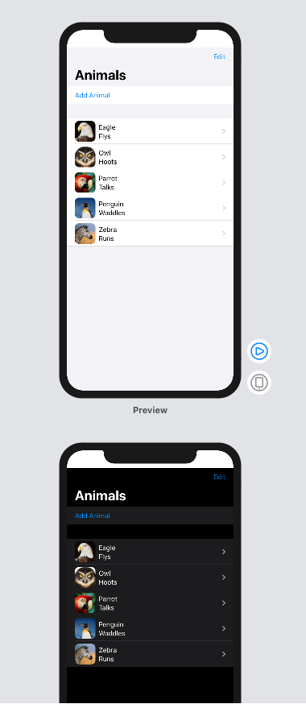

